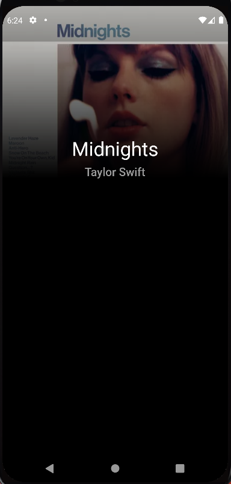

# Pop Music Albums App

An modern UI app displaying trending pop albums.

This app part of a live coding workshop to showcase how to build a beautiful UI super quickly with Flutter.

Workshop will be live on our GDSC LSU [YouTube Channel](https://www.youtube.com/channel/UCJPgY1BxAzFiTyOaGrOhpnw) on **Nov 3, 2022 at 6 PM CT**.

We hope to see you there!

### Structure

* The app has been divided into steps.
* Each step has starter and solution code with TODOs.
* Each step is a separate branch.

### How to code along with this repo/workshop?

* Complete the given TODOs in order.
* Compare the starter and solution branches for each step. (GitHub, Android Studio/VS Code, etc.)

### Steps

* Step 1

* Step 2

* Step 3

* Step 4

* Step 5

* Step 6

* Step 7

* Step 8

* Step 9

